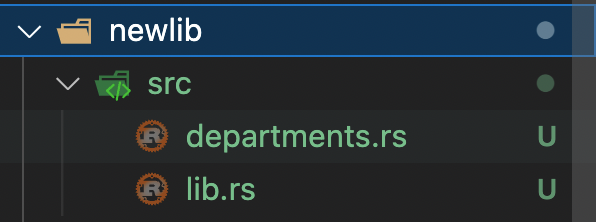

# Creating a Library

Creating Binary (executable) files is one option; another option is to create your Library files.

lib.rs - is used to create a library crate.

### **Part 1: Create a Department library**

To create a new library include --lib when creating a new cargo package&#x20;

cargo new newlib --lib

<figure><figcaption></figcaption></figure>

```
// departments.rs

pub mod dept {
    fn get_number(num: i32) -> String {
        match num {
            1 => return "123-456-7890".to_string(),
            2 => return "987-654-3210".to_string(),
            _ => return "000-000-0000".to_string(),
        }
    }

    pub mod sales {
        pub fn meet_customer(num: i32) {
            println!("Sales : meet customer {num}");
            let phone_number = super::get_number(num);
            println!("Sales calling {}", phone_number);
        }
    }

    pub mod service {
        pub fn meet_customer(num: i32) {
            println!("Service : meet customer {num}");
            let phone_number = super::get_number(num);
            let ticket_number = self::get_service_ticket_number(num);
            println!("Calling {phone_number} with ticket number {ticket_number}");
        }

        fn get_service_ticket_number(num: i32) -> i32 {
            match num {
                1 => return 2452423,
                2 => return 2341332,
                _ => return 6868765,
            }
        }
    } 
}

```

```
// lib.rs

pub mod departments;
```

```
// cargo build
```

### Part 2: Use the above library

```
// from terminal

cargo new newlib-test
```

```
// main.rs

use newlib::departments::dept;

fn main() {
    dept::sales::meet_customer(1);
    dept::service::meet_customer(3);
}
```

```
// cargo.toml

[dependencies]
newlib = {path = "../newlib"}
```
