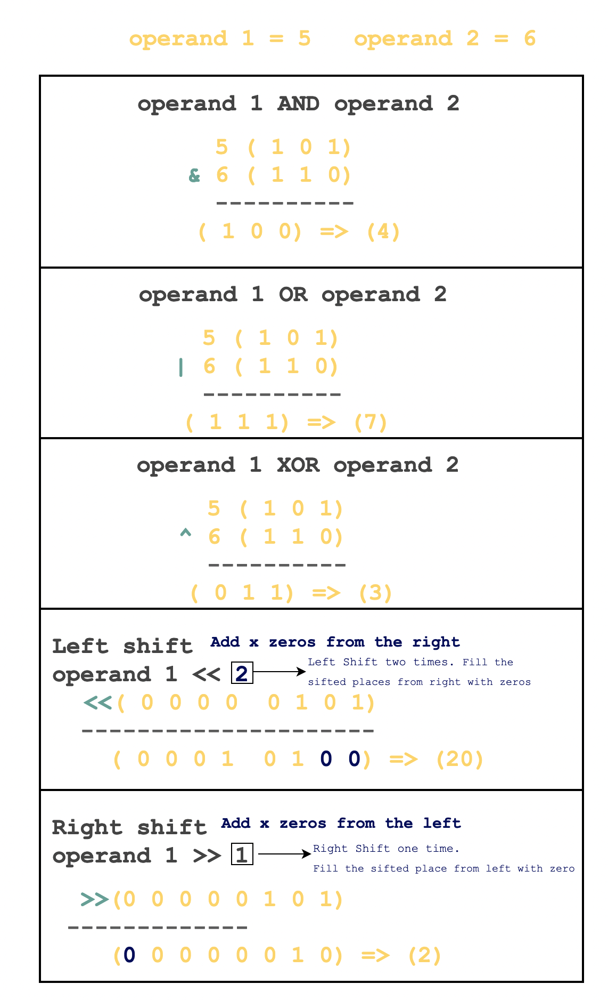

# Binary Operators

**Arithmetic Operators**

\+

\-

\*

/ (Division)

% (Modulus)

```
// Some code

fn main() {
    let a = 4;
    let b = 3;
    
    println!("Operand 1:{}, Operand 2:{}", a , b);
    println!("Addition:{}", a + b);
    println!("Subtraction:{}", a - b);
    println!("Multiplication:{}", a * b);
    println!("Division:{}", a / b);
    println!("Modulus:{}", a % b);
}
```

**Logical Operators**

&& (AND Operator)

|| (OR Operator)

! (Not Operator)


AND and OR are known as **LAZY Boolean expressions**.&#x20;

LHS is evaluated first, and based on the outcome RHS is evaluated.

In the case of AND, if LHS is False, then there is no need to evaluate the RHS.

In the case of OR, if LHS is True, then there is no need to evaluate the RHS.

```
// Some code

fn main() {
  let a = true;
  let b = false;
  println!("Operand 1:{}, Operand 2:{}", a , b);
  println!("AND:{}", a && b);
  println!("OR:{}", a || b);
  println!("NOT:{}", ! a);
}
```

**Comparison Operator**

**>, <, <=, >=, ==, !=**

```
// Some code

fn main() {
    let a = 2;
    let b = 3;
    println!("Operand 1:{}, Operand 2:{}", a , b);
    println!("a > b:{}", a > b);
    println!("a < b:{}", a < b);
    println!("a >= b:{}", a >= b);
    println!("a <= b:{}", a <= b);
    println!("a == b:{}", a == b);
    println!("a != b:{}", a != b);
}

```

**Bitwise Operator**

Bitwise operators work on the binary representation of numbers. They're often used for:

1. **Bit Manipulation**: Flipping bits, setting bits to 1 or 0.
2. **Optimization**: Faster arithmetic operations like multiplication or division by powers of 2.
3. **Masking**: Extracting specific bits from a number.
4. **Encoding & Decoding**: Data compression or encryption techniques.
5. **Networking**: IP address manipulation, subnet masking.

```
x = 57  # 0011 1001 in binary
mask = 15  # 0000 1111 in binary
result = x & mask  # 0000 1001, or 9 in decimal
```

**Common use cases with Rust**

1. **Memory Management**: Manipulating individual bits for custom allocators.
2. **File I/O**: Reading and writing binary files, especially in low-level systems programming.
3. **Graphics**: Bitwise operations are used in image processing for tasks like masking.
4. **Cryptography**: Implementing cryptographic algorithms often involves bitwise manipulation.
5. **Hardware Interaction**: Directly interacting with hardware often requires setting specific bits.

```
fn main() {
    let mut flags = 0b0000_0101;
    let mask = 0b0000_1000;
    flags |= mask;  // Sets the bit at position 3 to 1
    println!("{}",flags);
}
```

& - Bitwise AND

\| - Bitwise OR

^ - Bitwise XOR

! - Bitwise NOT

<< - Left Shift Operator

\>> - Right Shift Operator

<figure><figcaption><p>Src: Educative.io</p></figcaption></figure>


