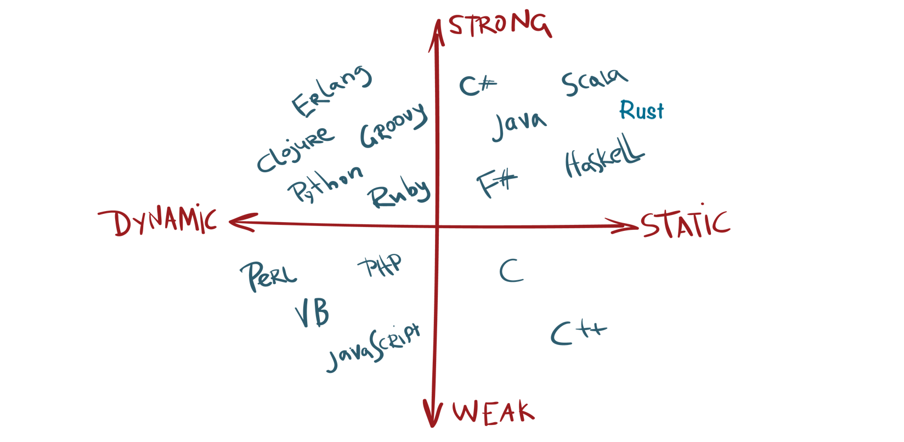

# Programming Matrix

**Can you spot Rust in this?**


<figure><figcaption><p>Image Source : Mayank Bhatnagar</p></figcaption></figure>


Rust is both strongly typed and statically typed:

* **Strongly Typed**: Without explicit conversion, you can't perform operations on incompatible types.
* **Statically Typed**: The variable type is known at compile-time, not runtime.

```
let num = 5;
let text = "hello";

// The next line won't compile
// let result = num + text; // Error
```
