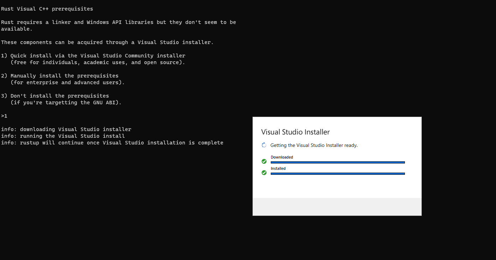
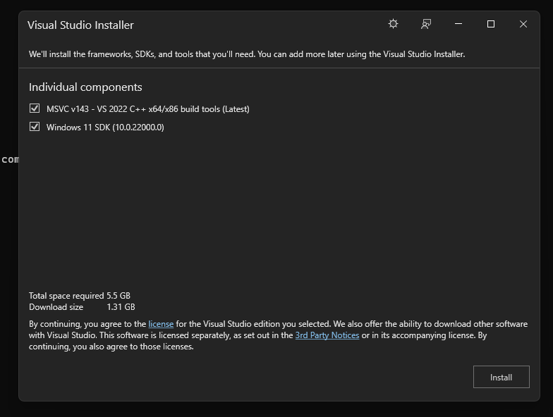
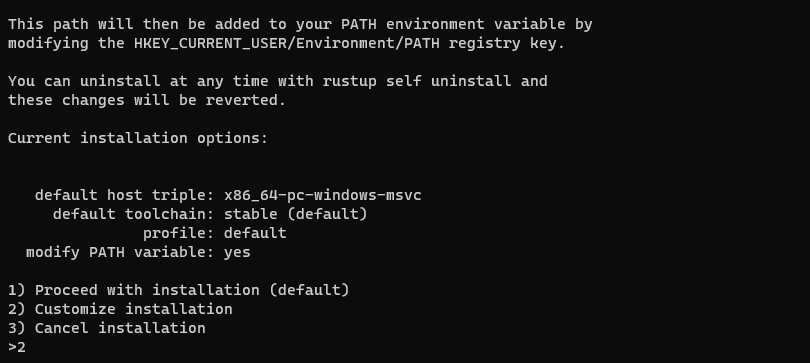
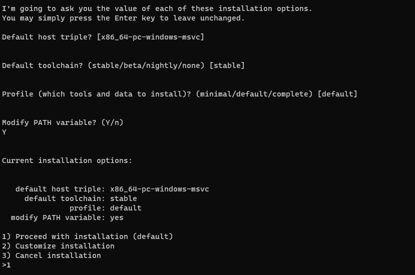

# Rust Installation

### MAC

```
// install rustup 

// more details https://www.rust-lang.org/tools/install

# curl --proto '=https' --tlsv1.2 -sSf https://sh.rustup.rs | sh

// Verify the installation

# rustc --version

# cargo --version
```

### Windows

Download the installer from this URL and execute the file.

```
https://static.rust-lang.org/rustup/dist/x86_64-pc-windows-gnu/rustup-init.exe
```

**Step 1**: Type 1 and hit enter

<figure><figcaption><p>Step - 1</p></figcaption></figure>

**Step 2**: Setup will download and install Visual Studio Installer. It doesn't matter even if you have VS Code, as this is a different installer.&#x20;

<figure><figcaption><p>Step - 2 : Download and Install VS Installer</p></figcaption></figure>

**Step 3**: Check the components and click Install.

Note: Based on the version of your windows, the screen will display the appropriate version number.

<figure><figcaption><p>Visual Studio Installer</p></figcaption></figure>

**Step 4:** Type 1 and press Enter to proceed with default installation. If you want to customize then type 2 and press Enter.

<figure><figcaption><p>Default setup</p></figcaption></figure>

**Step 5**: If you had chosen option 2, then confirm your settings and type 1 to proceed with the installation.

<figure><figcaption><p>Installation complete</p></figcaption></figure>

Step 6: Goto Command prompt (Start > Run > cmd)

type&#x20;

```
C:> rustc --version

C:> cargo --version
```

To verify the rust installation.

