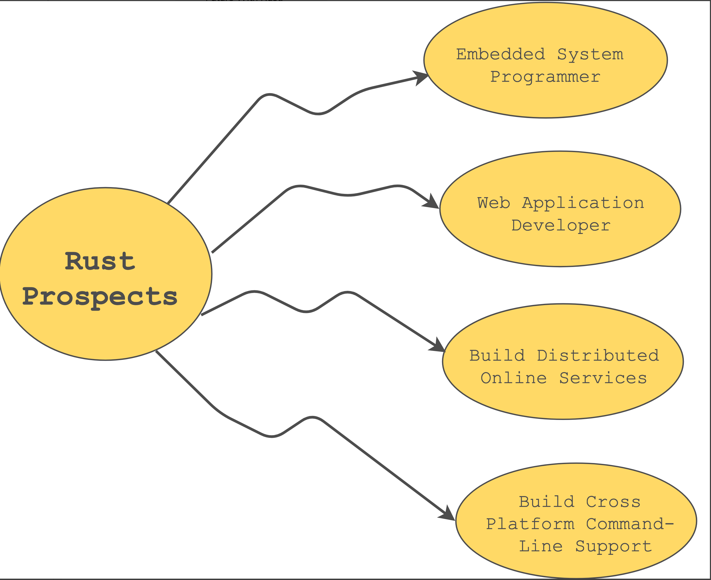

# Rust Overview

"Rust deals with low-level details of memory management, data representation, and concurrency."

### What is RUST?

* A _Mozilla_ employee, Graydon Hoare, started working on a language as a personal project.
* Later, _Mozilla_ sponsored the project in 2009 and announced it in 2010.
* The first stable release was on _**May 15, 2015**_.

Rust is a _system programming_ language that is safe and concurrent.

Many languages inspire Rust, such as

* System Programming Languages (C, C++)
* Functional Programming Languages (Haskell, Erlang)

### Why Rust

**Open Source**: Larger community, nightly builds, adoption by big companies.

**Reliability**: Rust is reliable because its model allows you to eliminate a wide range of memory-related bugs at compile time.

**Type Safe**: The compiler assures that no operation will be applied to a variable of the wrong type.

**Memory Safe**: Rust pointers (references) always refer to valid memory.

**Data Race Free**: Rust's borrow checker guarantees thread safety by ensuring, that multiple parts of a program can't mutate the same value at the same time.

**Speed**:  Rust is fast and memory-efficient. It can power production services, run on embedded devices, and easily interact with other languages because it has no runtime or garbage collector.

**Targets Bare metal**: Rust can target embedded and "bare metal" programming, making it suitable to write an OS kernel or device driver.&#x20;

**Security:** Rust is one of the safest programming languages because it emphasizes memory safety by analyzing a program’s memory compilation at build time, preventing bugs and memory errors caused by poor memory management.

**Efficiency:** Rust’s efficiency stems from its ability to assist developers in writing performance code quickly due to its very minimal and optimal runtime.

**Productivity:** The Rust programming language boosts developer productivity by allowing them to create highly resilient applications.

**Safety**: Ensures memory safety without the need for garbage collection. It ensures memory safety using ownership and its borrowing concept.

**Cargo Manager**: It's the package manager for Rust. It's similar to npm, pip.

**Error Messages**: Powerful compiler with useful error messages. it not only displays the line which has the error but, also the type of error.

**Efficient C Binding**: The Rust language can interoperate with the C language. It provides a foreign function interface to communicate with C API’s. Due to its ownership rules, it can guarantee memory safety.

### **Stackoverflow 2022 Survey**

<figure><figcaption>
<a href="https://survey.stackoverflow.co/2022/#technology-most-loved-dreaded-and-wanted"><strong>https://survey.stackoverflow.co/2022/#technology-most-loved-dreaded-and-wanted</strong></a>
</figcaption></figure>

### What Is Rust Used For? 

Rust is fit for:

* building powerful web applications
* embedded systems programming
* building distributed online services
* cross-platform command line support

### Who Uses Rust?

Some of the top companies listed here

* Drop Box
* Facebook
* Microsoft
* Discord
* Cloudflare
* Coursera
* Firefox
* Atlassian
* Amazon's Firecracker
* Databricks

**Rust is self-hosted, meaning the Rust compiler is written in Rust.**

The initial release was written using OCaml (General purpose programming language)

<figure><figcaption></figcaption></figure>

