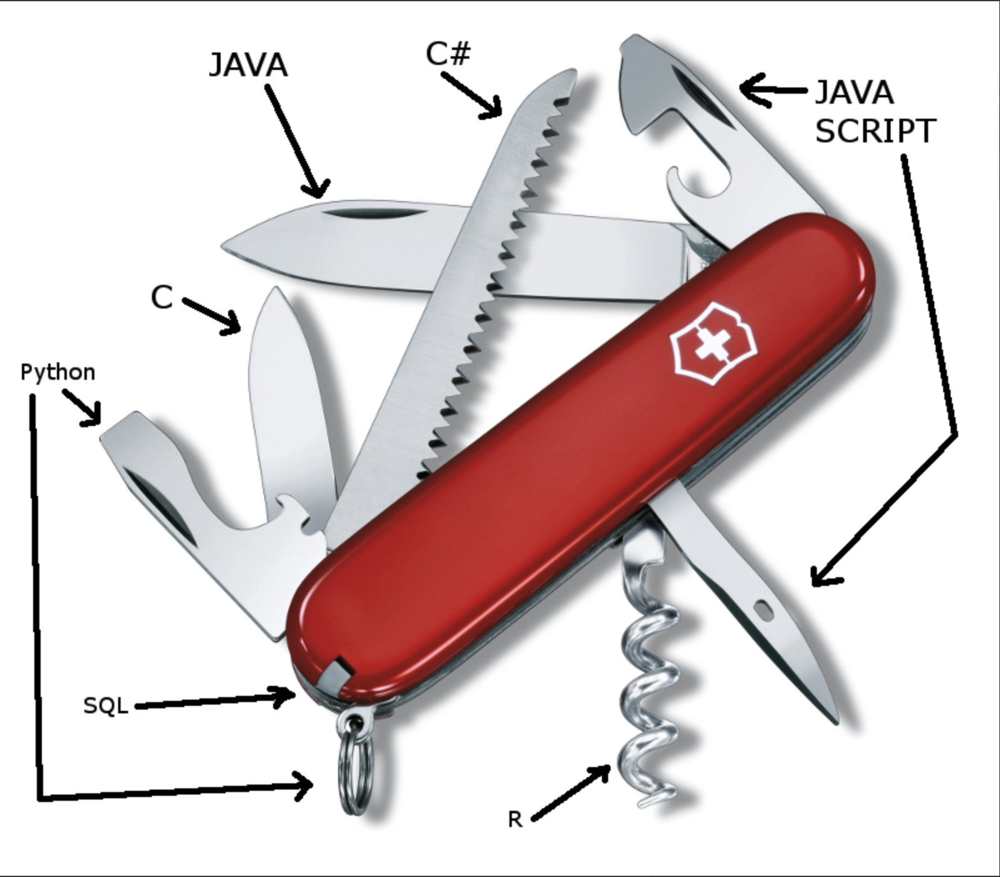

# Overview

### Why Learn Programming?

> “Everybody in this country should learn how to program a computer… because it teaches you how to think” \
> –**Steve Jobs**

Problem Solving

Automation

### How does coding help you personally?

Develop Interpersonal Skills

Coding is Creativity

Feeling empowered.

### Why learn more than one Language?

> **Mastering more than one language is often a watershed in the career of a professional programmer.** Once a programmer realizes that programming principles transcend the syntax of any specific language, the doors swing open to knowledge that truly makes a difference in quality and productivity. — _Steve McConnell_

<figure><figcaption>
<em>Img Src: Brian Johnson (Quora.com)</em>
</figcaption></figure>

