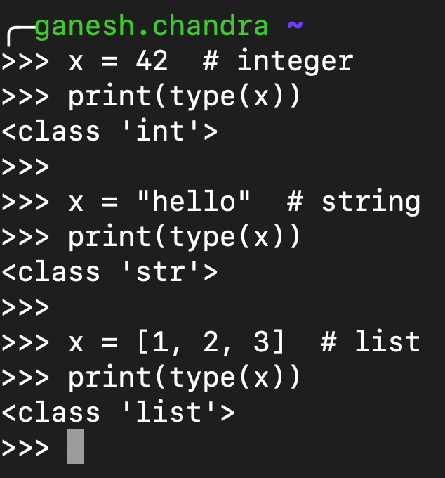

# Static vs Dynamic

**Statically typed** languages check the types and look for type errors during compile time.

Static type means checking for types before running the program. This lets the compiler decide whether a given variable can perform the requested actions.&#x20;

Explicit variable-type declarations are usually required.

It is easy to catch errors during development.&#x20;

```
int a = "Hello";
```

The above statement will result in an error during compile time itself.

Popular languages that are statically typed are

C/C++/GO/Haskell/JAVA/SCALA/RUST


**Dynamically typed** languages check the types and look for type errors during runtime.

Dynamic type means checking for types while running the program. It is risky when an application fails in production.

Explicit declarations are not required.

Variable assignments are dynamic and can be altered. (to some degree)

Popular languages that are dynamically typed are

Python/Ruby/Erlang/Javascript/PHP/Perl

Simple Python example



