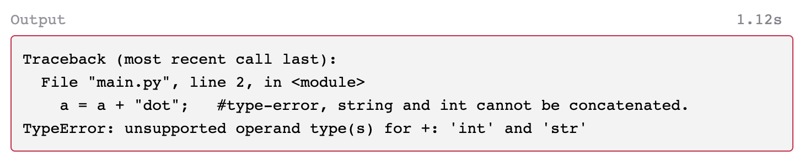
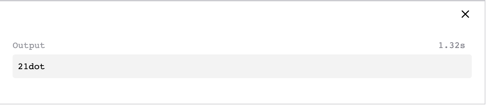

# Strongly Typed vs Weakly Typed

**Strongly typed** languages don't allow implicit conversions between unrelated types.

You usually can't perform operations on incompatible types without explicit conversion in a strongly typed language. Python is strongly typed despite being dynamically typed.

For example, Python is _a strongly-typed language_

```
#Python

a = 21;            #type assigned as int at runtime.
a = a + "dot";   #type-error, string and int cannot be concatenated.
print(a);
```

<figure><figcaption></figcaption></figure>

**Weakly typed** languages make conversions between unrelated types implicitly.


Similarly, Javascript is a weakly-type language.

```
/*
As Javascript is a weakly-typed language, it allows implicit conversion
between unrelated types.
*/

a = 21;             
a = a + "dot";
console.log(a);
```

<figure><figcaption></figcaption></figure>
