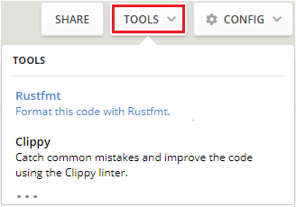
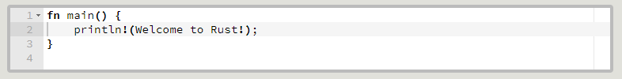
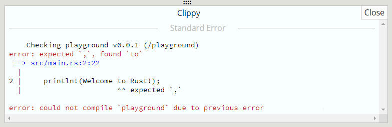
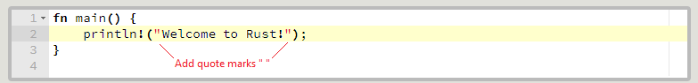

# Playground

If you just want to try a bit of Rust code or check the syntax for a definition in a Rust library. You might also be looking for a way to share some code with others. 

The Rust language offers support for these tasks in the Rust playground.

[https://play.rust-lang.org/](https://play.rust-lang.org/)

In the playground, you can access methods and functions in the Rust std standard library. 

The top 100 most-downloaded crates in the crates.io library are also available along with their dependencies.


---

## Demo

Let's try with a simple example.

```rust
fn main(){println!(Welcome to Rust!);}
```

<figure><figcaption>Image Src: Microsoft Rust Documentation</figcaption></figure>

The tool adjusts the code to follow official Rust styles:

<figure><figcaption>Image Src: Microsoft Rust Documentation</figcaption></figure>

Select **Tools** > **Clippy** to check for mistakes in the code. The results are displayed under the editor:

<figure><figcaption>Image Src: Microsoft Rust Documentation</figcaption></figure>

To fix the sample code, add quote marks around the text "Welcome to Rust!":

<figure><figcaption>Image Src: Microsoft Rust Documentation</figcaption></figure>

Now we'll compile the code and run the program.

Image Src: Microsoft Rust Documentation
