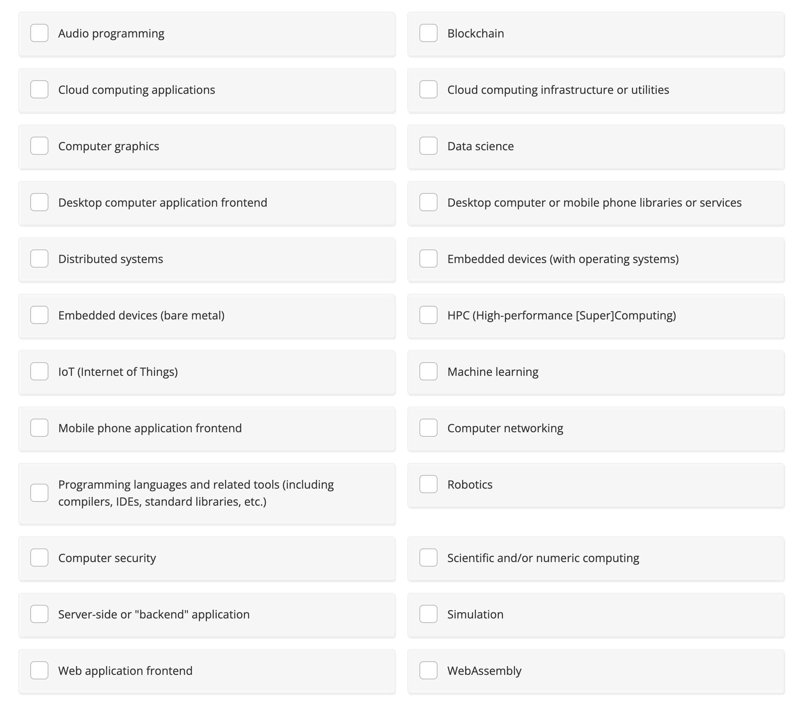

# Rust is used for...

<figure><figcaption>
Src: Unknown
</figcaption></figure>

* Audio programming: Rust's performance and low-level control are beneficial for developing audio processing applications.

* Blockchain: Rust is used in blockchain projects like Substrate due to its performance and safety features.

* Cloud computing applications: Rust can be used to build efficient cloud-native applications.

* Cloud computing infrastructure or utilities: Rust's performance and concurrency are ideal for infrastructure tools and utilities.

* Computer graphics: Libraries like gfx-rs are used for graphics programming in Rust.

* Data science: While not as dominant as Python, Rust has growing support for data science through libraries like Polars.

* Desktop computer application frontend: Frameworks like druid allow for building desktop applications.

* Desktop computer or mobile phone libraries or services: Rust is used to create backend services and libraries that power applications.

* Distributed systems: Rust is used in distributed systems projects like TiKV due to its performance and safety.

* Embedded devices (bare metal): Rust's control over memory and safety features make it suitable for bare-metal programming.

* Embedded devices (with operating systems): Rust can be used to develop applications for embedded devices with operating systems.

* HPC (High-performance [Super]Computing): Rust is used in high-performance computing applications.

* IoT (Internet of Things): Rust is suitable for IoT applications due to its low-level control and performance.

* Machine learning: Rust's ecosystem is growing in machine learning, with libraries like tch-rs.

* Mobile phone application frontend: Rust can be used in mobile app development, particularly for performance-critical components.

* Computer networking: Rust is popular for building networking applications due to its safety and concurrency features.

* Programming languages and related tools (including compilers, IDEs, standard libraries, etc.): 

* Rust is used for developing new programming languages and related tools.

* Robotics: Rust's safety and performance are advantageous in robotics applications.

* Computer security: Rust's safety features help in developing secure applications.

* Scientific and/or numeric computing: Rust is used for scientific computing due to its performance.

* Server-side or "backend" application: Rust is widely used for backend development.

* Simulation: Rust is suitable for simulation applications due to its performance.

* Web application frontend: Through WebAssembly, Rust can be used for web frontend development.

* WebAssembly: Rust is frequently compiled to WebAssembly for high-performance web applications.