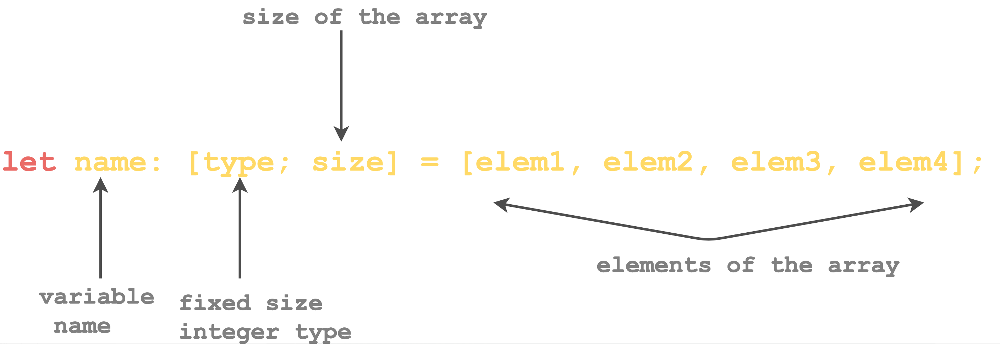

# Arrays

An array is a **homogenous sequence of elements**.&#x20;

A Collection of values of the same type is to be stored in a single variable.&#x20;

Fixed length & Length known at compile time.

By default, the first element is always at index 0.


By default, arrays are immutable.

<figure><figcaption><p><strong>Src:Educative.io</strong></p></figcaption></figure>

**Define an Array**

```rust
#[allow(unused_variables, unused_mut)]
fn main() {
   //define an array of size 4
   let arr:[i32;4] = [1, 2, 3, 4]; 
   // initialize an array of size 4 with 0
   let arr1 = [0 ; 4]; 
}
```

**Access Array element**

```rust
fn main() {
   //define an array of size 4
   let arr:[i32;4] = [1, 2, 3, 4]; 
   //print the first element of array
   println!("The first value of array is {}", arr[0]);
   // initialize an array of size 4 with 0
   let arr1 = [10; 14]; 
   //print the first element of array
   println!("The first value of array is {}", arr1[0]);
}
```

**Mutable Arrays**

```rust
fn main() {
    //define a mutable array of size 4
    let mut arr:[i32;4] = [1, 2, 3, 4]; 
    println!("The value of array at index 1: {}", arr[1]);
    arr[1] = 9;
    println!("The value of array at index 1: {}", arr[1]);
}
```

**Print Array**

Using Loop or using debug trait

```rust
fn main() {
    //define an array of size 4
    let arr:[i32;4] = [1, 2, 3, 4]; 
    //Using debug trait
    println!("\nPrint using a debug trait");
    println!("Array: {:?}", arr);
}
```

**Get Array Length**

```rust
fn main() {
    //define an array of size 4
    let arr:[i32;4] = [1, 2, 3, 4]; 
    // print the length of array
    println!("Length of array: {}", arr.len());
}

```

**Slice**

Slice is basically a portion of an array. It lets you refer to a subset of a contiguous memory location. But unlike an array, the size of the slice is not known at compile time.

A slice is a two-word object, the first word is a data pointer and the second word is a slice length.

Data pointer is a programming language object that points to the memory location of the data, i.e., it stores the memory address of the data.


```rust
fn main() {
    //define an array of size 4
    let arr:[i32;4] = [1, 2, 3, 4]; 
    //define the slice
    let slice_array1:&[i32] = &arr;
    let slice_array2:&[i32] = &arr[0..2];
    let slice_array2:&[i32] = &arr[0..];
    // print the slice of an array
    println!("Slice of an array: {:?}", slice_array1);
    println!("Slice of an array: {:?}", slice_array2);
}
```
