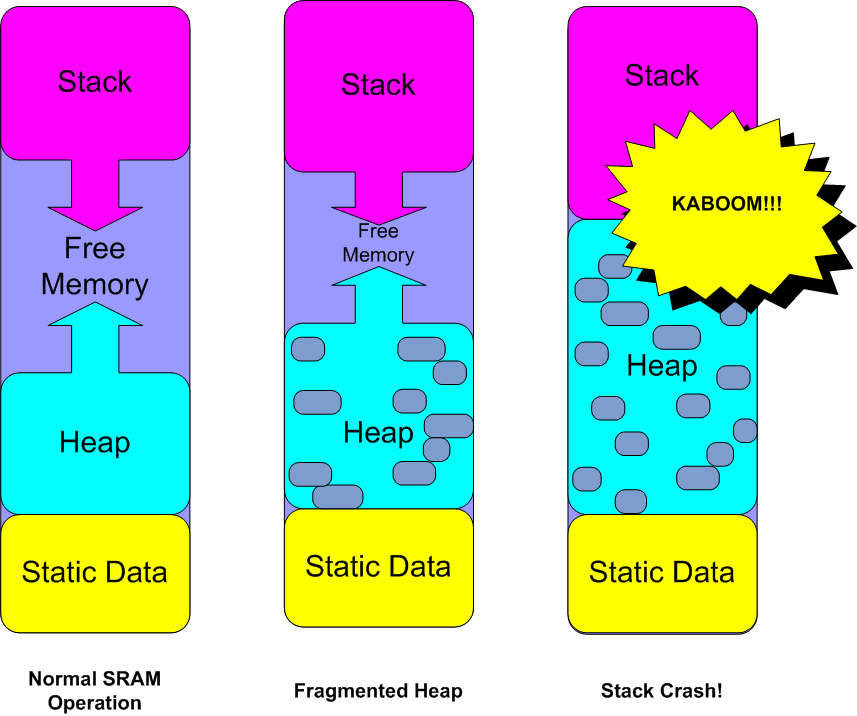
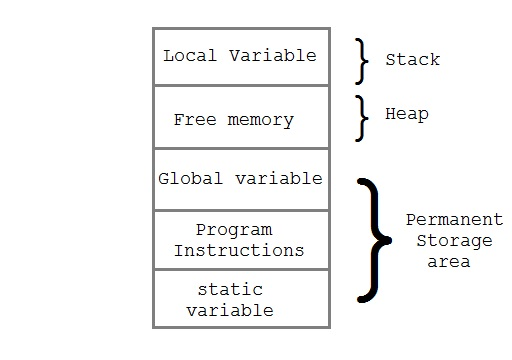
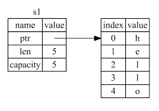

# Stack - Heap

<figure><figcaption><p>Src: Adafruit.com</p></figcaption></figure>

We will learn the concept of memory management and how Rust can guarantee memory safety without a Garbage collector.

Like most programming languages, Rust stores data in three different structure parts of your computer memory.

### Static/Data Memory

For data that is fixed in size and static (i.e. always available throughout the life of the program).&#x20;

```
println!("Hello");
```

This text's bytes are only ever read from one place and therefore can be stored in this region. Compilers make lots of optimizations with this kind of data, and they are generally considered very fast to use since locations are known and fixed.

**Program Binary**

**Static Variables**

**String Literals**

<figure><figcaption><p>Img Src: OpenGenus</p></figcaption></figure>

### **Stack**

**Last In First Out**

For data that is declared as variables within a function. The location of this memory never changes for the duration of a function call; because of this compilers can optimize code so stack data is very fast to access.

**Function Arguments**

**Local Variables**

**Size is known at Compile time**

let a:i32 = 100;

Rust knows this will take 32 bits of memory.

So the variable is stored in Stack Memory.

Automatic cleanup, when the function returns.

Example: Courtesy mit.edu

```rust
fn foo() {
    let y = 5;
    let z = 100;
}

fn main() {
    let x = 42;

    foo();
}
```


| Address | Name | Value |
| ------- | ---- | ----- |
| 0       | x    | 42    |

After calling the function foo()


| Address | Name | Value |
| ------- | ---- | ----- |
| 2       | z    | 100   |
| 1       | y    | 5     |
| 0       | x    | 42    |

**Note: Memory address is taking into account DATA TYPE SIZE. It's just a representation.**

After foo() gets executed, control transfers to main, and the values are deallocated automatically.

| Address | Name | Value |
| ------- | ---- | ----- |
| 0       | x    | 42    |

### Copy Trait

```rust
    fn main() {
    // i32 is a simple type and are normally stored on the stack.
    // copy trait

    let x = 42;
    let y = x; 

    // The value bound to x is Copy, so no error will be raised.
    println!("{:?}", (x, y));

    // The value bound to x is Copy, so no error will be raised.
    println!("{:p},{:p}", &x, &y);
}

```

### **Heap**

For data that is created while the application is running. Data in this region may be added, moved, removed, resized, etc. Because of its dynamic nature, it's generally considered slower to use, but it allows for much more creative usage of memory. When data is added to this region, we call it an allocation. When data is removed from this section, we call it deallocation.

Example: Vector, String

```rust
// Some code

fn main(){
    let s1=String::from("hello");
    println!("{}",s1)
}
```

<figure><figcaption></figcaption></figure>

```rust
// Move Trait (Heap)

fn main() {
    let mut name = String::from("Hello World");
    println!("Memory address of name: {},{:p} \n", name,&name);

    //moving

    let name1 = name;
    println!("Memory address of name1: {},{:p} \n", name1,&name1);
    
    //println!("Memory address of name: {},{:p} \n", name,&name);

    // Setting up another Value for the variable name

    name = String::from("Dear World");
    println!("Memory address of name: {},{:p}\n", name,&name);
}
```

Example: pdf (stack) - printed book (heap)

```rust
// Copy Trait (Stack - because of using String Literal)

fn main() {
    let name = "Hello World";
    println!("Memory address of name: {},{:p} \n", name,&name);

    //Copying

    let name1 = name;
    println!("Memory address of name1: {},{:p} \n", name1,&name1);
    
    println!("Memory address of name: {},{:p} \n", name,&name);
}
```

