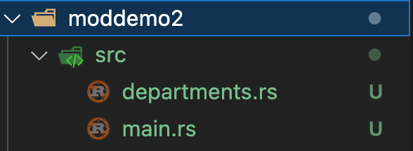

# Module Multiple files

cargo new moddemo2

create files as given below

<figure><figcaption></figcaption></figure>

```
// departments.rs

pub mod dept {
    fn get_number(num: i32) -> String {
        match num {
            1 => return "123-456-7890".to_string(),
            2 => return "987-654-3210".to_string(),
            _ => return "000-000-0000".to_string(),
        }
    }

    pub mod sales {
        pub fn meet_customer(num: i32) {
            println!("Sales : meet customer {num}");
            let phone_number = super::get_number(num);
            println!("Sales calling {}", phone_number);
        }
    }

    pub mod service {
        pub fn meet_customer(num: i32) {
            println!("Service : meet customer {num}");
            let phone_number = super::get_number(num);
            let ticket_number = self::get_service_ticket_number(num);
            println!("Calling {phone_number} with ticket number {ticket_number}");
        }

        fn get_service_ticket_number(num: i32) -> i32 {
            match num {
                1 => return 2452423,
                2 => return 2341332,
                _ => return 6868765,
            }
        }
    }

    #[cfg(test)] // Only compiles when running tests
    mod tests {
        use crate::get_standard_greetings;

        #[test]
        fn test_customerphone() {
            assert_eq!("000-000-0000", super::get_number(4));
        }

        #[test]
        fn test_standard_greeting() {
            assert_eq!("Welcome to our store.", get_standard_greetings());
        }
    }
}

```


```
// main.rs


// Refer the external file
mod departments;

// Import the module
use departments::dept;

fn main() {
    println!("{:?}", get_standard_greetings());
    dept::sales::meet_customer(1);
    dept::service::meet_customer(3);
}

fn get_standard_greetings() -> String {
    return "Welcome to our store.".to_string();
}

```

