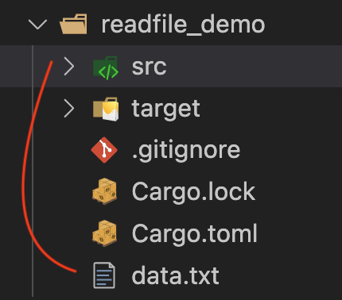

# File Handling

FS Module is not part of the default prelude.

## Rust Prelude

The prelude is the list of things that Rust automatically imports into every Rust program. It’s kept as small as possible and is focused on things, particularly traits, which are used in almost every single Rust program.

The Data file should be in the same level src folder.

<figure><figcaption><p>data.txt should be at the same level src folder</p></figcaption></figure>

```rust
// data.txt

Rachel
Monica
Phoebe
Chandler
Joey
Ross
```

## Read File

```rust
// main.rs
use std::fs;

fn main(){
	let contents = fs::read_to_string("data.txt").unwrap();
	println!("{:?}",contents);
}
```

## Read Line by Line

```rust
use std::fs;

fn main(){
	let contents = fs::read_to_string("data.txt").unwrap();
	for line in contents.lines(){
		println!("{}",line);
	}
}
```

Rust can also read nontext files (such as images and  binaries)&#x20;

It reads as a vector of u8.

```rust
// Read as vector of u8

use std::fs;

fn main(){
	let contents = fs::read("data.txt").unwrap();
	println!("{:?}", contents);
}
```

## Write File

```rust
// Write a simple file

use std::fs;

fn main() {
    let mut text = String::new();
    text.push_str("Rust is strong and statically typed language.");
    text.push_str("Rust is super strict.");
   
    fs::write("newfile.txt",text);
}
```

## Points to remember

Simple to use

Will replace the contents of an existing file

Writes entire contents of the file.

**How to append**

```rust
use std::fs;
use std::io::prelude::*;

fn main() {
    let mut text = String::new();
    text.push_str("Rust is strong and statically typed language.");
    text.push_str("Rust is super strict.");

    //fs::write("newfile.txt",text);

    let mut file = fs::OpenOptions::new().append(true).open("newfile.txt").unwrap();
    file.write(b"Rust is awesome");
}

```

Write fn doesn't care about datatype. It thinks data is a series of bytes and it expects the value to be an array of u8 values.

## Simple Find Command Line simulator

```rust
// friends.txt

Rachel
Monica
Phoebe
Chandler
Joey
Ross
```

```rust
//cargo run friends.txt Ross

use std::env;
use std::fs;

fn main() {
    if env::args().len() < 2 {
        eprintln!("Program requires two arguments: <file path> <search name>");
        std::process::exit(1);
    }
    let file_path = env::args().nth(1).unwrap();
    let search_name = env::args().nth(2).unwrap();

    let contents = fs::read_to_string(file_path).unwrap();
    
    for line in contents.lines() {
        if line == search_name {
            println!("{} is part of Friends show", search_name);
            return;
        }
    }

    println!("{} is not a part of Friends show!", search_name);
}
```

Good resource if you want to recreate standard Linux commands using RUST

[https://doc.rust-lang.org/rust-by-example/std\_misc/fs.html](https://doc.rust-lang.org/rust-by-example/std\_misc/fs.html)

You will come across few new notations like OK, Err we will read about them in the coming weeks.