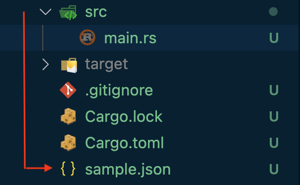

# JSON

The flexible way to store & share data across systems. It's a text file with curly braces & key-value pairs { }

Simplest JSON format

```
{"id": "1","name":"Rachel"}
```

## Properties

Language Independent.

Self-describing and easy to understand.

## Basic Rules

Curly braces to hold the objects.

Data is represented in Key-Value or Name-Value pairs.

Data is separated by a comma.

The use of double quotes is necessary.

Square brackets \[ ] hold an array of data.

## JSON Values

```
String  {"name":"Rachel"}

Number  {"id":101}

Boolean {"result":true, "status":false}  (lowercase)

Object  {
            "character":{"fname":"Rachel","lname":"Green"}
        }

Array   {
            "characters":["Rachel","Ross","Joey","Chanlder"]
        }

NULL    {"id":null}
```

## Sample JSON Document

```
{
    "characters": [
        {
            "id" : 1,
            "fName":"Rachel",
            "lName":"Green",
            "status":true
        },
        {
            "id" : 2,
            "fName":"Ross",
            "lName":"Geller",
            "status":true
        },
        {
            "id" : 3,
            "fName":"Chandler",
            "lName":"Bing",
            "status":true
        },
        {
            "id" : 4,
            "fName":"Phebe",
            "lName":"Buffay",
            "status":false
        }
    ]
}
```

## JSON Best Practices

**No Hyphen in your Keys.**

```
{"first-name":"Rachel","last-name":"Green"}  is not right. ✘
```

**Under Scores Okay**

```
{"first_name":"Rachel","last_name":"Green"} is okay ✓
```

L**owercase Okay**

```
{"firstname":"Rachel","lastname":"Green"} is okay ✓
```

**Camelcase best**

```
{"firstName":"Rachel","lastName":"Green"} is the best. ✓
```
## JSON & RUST

* The **Deserialize** trait is required to parse (that is, read) JSON strings into this Struct.
* The **Serialize** trait is required to format (that is, write) this Struct into a JSON string.
* The **Debug** trait is for printing a Struct on a debug trace.


```rust
// main.rs

use serde_derive::{Deserialize, Serialize};
use std::env;
use std::fs;

// Remember attributes should be below the use statements

#[allow(non_snake_case)]

#[derive(Deserialize, Serialize, Debug)]
struct Characters {
    id: u32,
    fName: String,
    lName: String,
    status: bool
}

#[derive(Deserialize, Serialize, Debug)]
struct CharacterArray {
    characters: Vec<Characters>
}

fn main()  {
    let input_path = env::args().nth(1).unwrap();
    //let output_path = env::args().nth(2).unwrap();

    let friends = {
        let jsondata = fs::read_to_string(&input_path).unwrap();
        // Load the Friends structure from the string.
        serde_json::from_str::<CharacterArray>(&jsondata).unwrap()
    };
    
    for index in 0..friends.characters.len() {
        println!("{} - {}",friends.characters[index].fName,friends.characters[index].lName);
    }
}
```

Save the above json document as sample.json

<figure><figcaption></figcaption></figure>

```
// cargo.toml

[dependencies]
serde = "1.0.147"
serde_derive = "1.0.147"
serde_json = "1.0.87"
```

## Convert Struct to JSON

```rust
use serde_derive::{Serialize};

#[derive(Serialize)]
#[serde(rename_all = "camelCase")]

struct Person {
    first_name: String,
    last_name: String,
    id: i32,
    status: bool
}

fn main() {
    let person = Person {
        first_name: "Rachel".to_string(),
        last_name: "Green".to_string(),
        id: 1,
        status:true
    };

    let person1 = Person {
        first_name: "Monica".to_string(),
        last_name: "Geller".to_string(),
        id: 2,
        status:true
    };
    
    let v = vec![&person,&person1];

    let output_path = "sample_output.json";

    let json = serde_json::to_string_pretty(&v).unwrap();  // <- unwrap

    println!("{}", json);
    
    std::fs::write(
        output_path,
        json,
    ).unwrap()
}
```

```
// cargo.toml

serde = "1.0.147"
serde_derive = "1.0.147"
serde_json = "1.0.87"
```