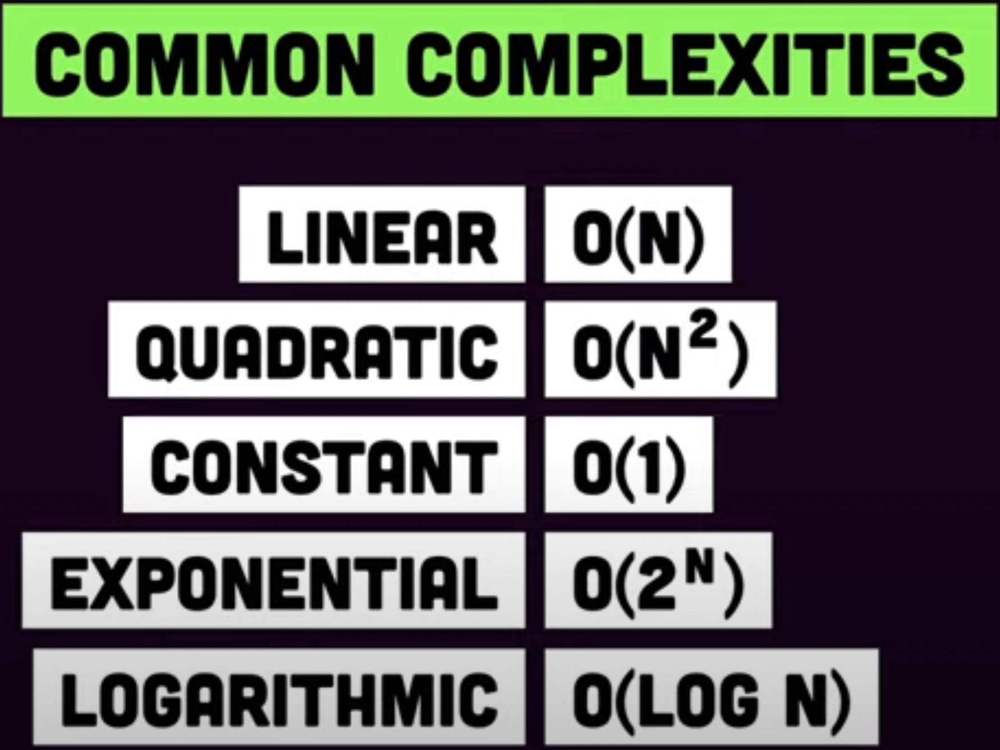
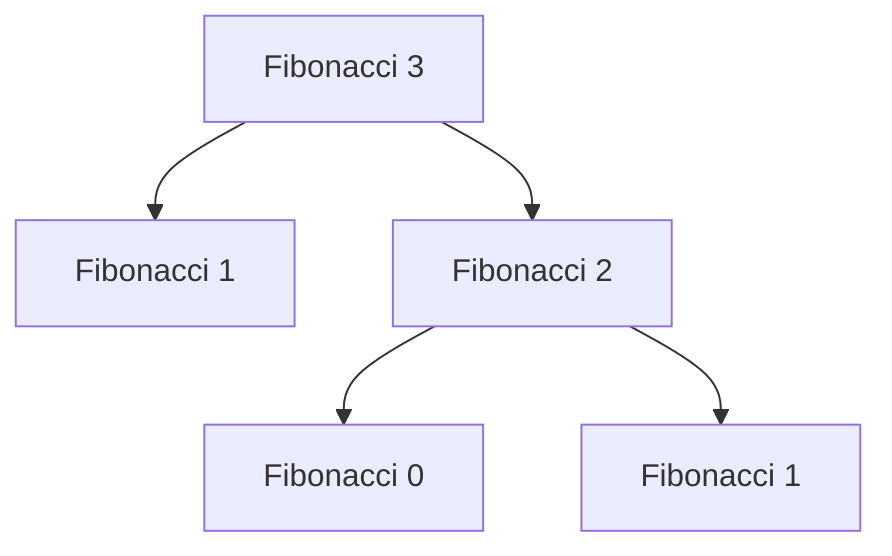
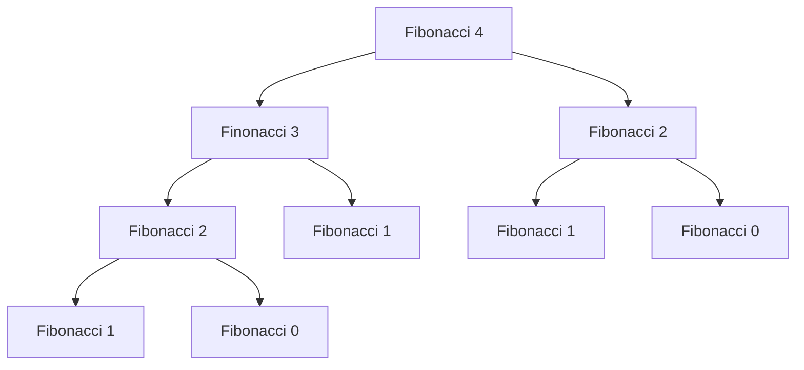
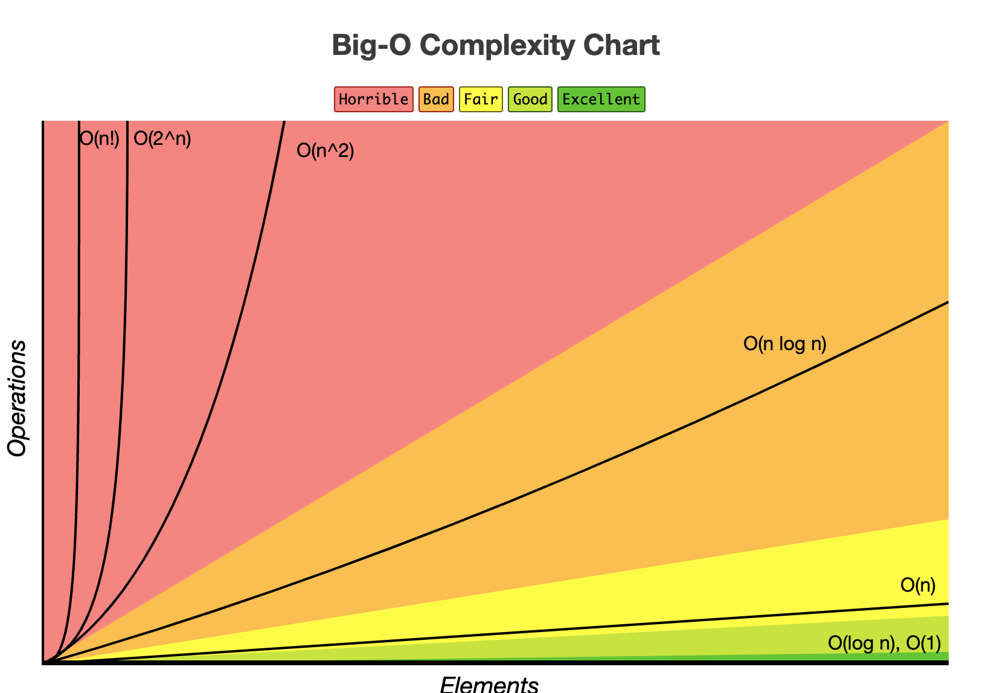

# Big O Notation

## Algorithmic Complexity

When analyzing an algorithm,

**Time Complexity**: The time it takes to execute the code.
**Space Complexity**: The space taken in the memory to execute the code.

Following Notations are used to represent Algorithmic Complexity. Big O is what everybody is interested in.

Big - Omega = Best Case
Big - Theta = Average Case
**BIG O = Worst Case**

<figure><figcaption></figcaption></figure>

Will try to use general algorithms not any specific programming syntaxes.

### Constant or Static Complexity - O(1)

``` rust
// Defining a constant
const FAHRENHEIT_CONSTANT: f64 = 32.0;

// Defining a static variable
static MULTIPLIER: f64 = 1.8;

fn main() {
    println!("Enter Name:");

    // Example temperature conversion calculations
    let fahrenheit: f64 = 100.0; // Example input
    let celsius = fahrenheit_to_celsius(fahrenheit);
    let fahrenheit_converted_back = celsius_to_fahrenheit(celsius);

    println!("Celsius: {:.2}, Fahrenheit: {:.2}", celsius, fahrenheit_converted_back);
}

fn fahrenheit_to_celsius(f: f64) -> f64 {
    (f - FAHRENHEIT_CONSTANT) / MULTIPLIER
}

fn celsius_to_fahrenheit(c: f64) -> f64 {
    (c * MULTIPLIER) + FAHRENHEIT_CONSTANT
}

```

Each line is of complexity O(1). Because its handling only one item.

n \* O(1);  

n is the number of lines.

**While finding the pattern we ignore the constant values.**&#x20;

So we remove n and the complexity is O(1)

### Linear Complexity O(N)

In this case the time and size changes based on number of input values.

For example

```
// Linear Complexity

for i = 1 to N
print (i)
```

if N = 10 it will be print faster, if N = 1Million the time taken will be linear.

These kinds of Linear changes is called  O(N)

```rust
fn main() {
    // Create an array of integers
    let numbers = [1, 2, 3, 4, 5, 6, 7, 8, 9, 10];

    // Call the function to print the elements
    print_elements(&numbers);
}

fn print_elements(numbers: &[i32]) {
    // Iterate over the elements of the array
    for number in numbers.iter() {
        println!("{}", number);
    }
}
```

### Quadratic Complexity

```
// Quadratic Complexity

for i = 1 to N
    for j = 1 to M
        print (i,j)   
```

```rust
fn main() {
    let n = 5; // Example value for N
    let m = 5; // Example value for M

    print_pairs(n, m);
}

fn print_pairs(n: usize, m: usize) {
    for i in 1..=n {
        for j in 1..=m {
            println!("({}, {})", i, j);
        }
    }
}
```
For every i, there is another loop called j

N \* N =  O(N Square)

If  N = 2 then the process will iterate  4 times.

### What is the Complexity of these ?

```
for i = 1 to n
print (i)

for j = 1 to n
print (j)
```

```
 
for (i = 0; i < N; i++) {
    for (j = 0; j < N; j++) {
        sequence of statements
    }
}
for (k = 0; k < N; k++) {
    sequence of statements
}
```


```
for i = 1 to N
    for j = 1 to M
        for k = 1 to 1000
            print (i,j,k)
        
```


### Exponential Complexity

O(2 power N)

With the increase in input there is an exponential growth in Time and Space.

**Fibonacci Series**

0 1 1 2 3 5 8 13 21 34 55 89 144 233 377 610

**Algorithm**

```
function fibonacci(n){
    if n = 0 
        return 0
    if n = 1 
        return 1
    else
        return fibonacci(n - 2) + fibonacci(n - 1)
```

```rust
fn fibonacci(n: u32) -> u32 {
    if n == 0 {
        return 0;
    }
    if n == 1 {
        return 1;
    }
    return fibonacci(n - 2) + fibonacci(n - 1);
}

fn main() {
    let n = 6; 
    println!("Fibonacci series up to {}:", n);
    for i in 0..=n {
        println!("Fibonacci({}) = {}", i, fibonacci(i));
    }
}
```

**For example**

(2 power n-1)

For input = 3, number of iterations is 4



For input = 4, number of iterations is 8;



## Logarithmic Complexity  O(Log N)

Increase in number of input is exponential but time and space growth is Linear.

```
for (i= 1; i< n; i = i **2)
    print(i)
```

or Binary Search

1  23  45  56  89  90  110  130

Pick mid point, search either left or right.

```rust
fn binary_search(arr: &[i32], target: i32) -> Option<usize> {
    let mut low = 0;
    let mut high = arr.len() - 1;

    while low <= high {
        let mid = low + (high - low) / 2;

        if arr[mid] == target {
            return Some(mid);
        } else if arr[mid] < target {
            low = mid + 1;
        } else {
            high = mid - 1;
        }
    }

    None
}

fn main() {
    let arr = [1, 3, 5, 7, 9, 11, 13, 15, 17, 19, 20, 21, 24, 25, 30, 44,55,56];
    let target = 17;

    match binary_search(&arr, target) {
        Some(index) => println!("Target {} found at index: {}", target, index),
        None => println!("Target {} not found in the array", target),
    }
}
```

<figure><figcaption><p>bigocheatsheet.com</p></figcaption></figure>

Fore more visit

https://bigocheatsheet.com

## Answers

- O(1)
- O(N sq)
- O(N x M)