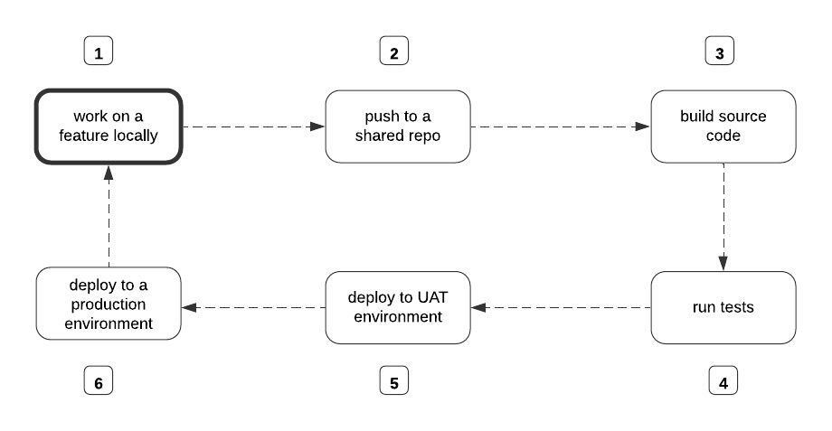
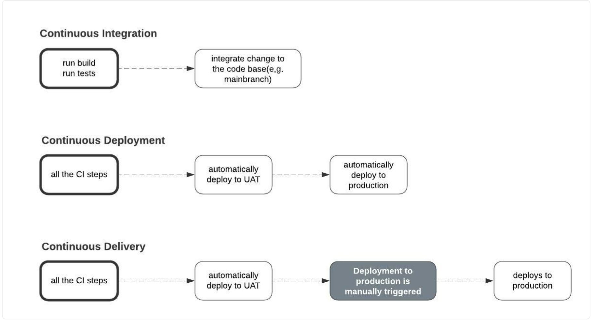

# CICD

A CI/CD Pipeline is simply a development practice. It tries to answer this one question: How can we ship quality features to our production environment faster?



[img src](https://www.freecodecamp.org/)

Without the CI/CD Pipeline, the developer will manually perform each step in the diagram above. To build the source code, someone on your team has to run the command to initiate the build process manually.

## Continuous Integration (CI)

Automatically tests code changes in a shared repository. Ensures that new code changes don't break the existing code.

## Continuous Delivery (CD)

Automatically deploys all code changes to a testing or staging environment after the build stage, then manually deploys them to production.

## Continuous Deployment 

This happens when an update in the UAT environment is automatically deployed to the production environment as an official release.



## CICD Tools

### On-Prem & Web

- Jenkins
- Circle CI

### Web Based

- Github Actions
- GitLab

### Cloud Providers

- AWS CodeBuild
- Azure DevOps
- Google Cloud Build

---

## GitHub Actions

### Free and Popular

- Workflows
- Jobs
- Events
- Actions
- Runners

*Runners* - Remote computer that GitHub Actions uses to execute the jobs.

Github-Hosted Runners
    - ubuntu-latest
    - windows-latest
    - macos-latest

*Actions* - Reusable commands that can be used in your config file.

https://github.com/features/actions

*Events* - Trigger the execution of the job.

On Push / Pull
On Schedule
On workflow_dispatch (Manual Trigger)

*Jobs* - Tasks GitHub Action to execute.

It consists of steps that GitHub Actions will execute on a runner.

*Workflows* - Automated processes that contain one or more logical jobs.
Entire to-do list.

---

### YAML (Yet Another Markup Language)

```YAML is a human-friendly data serialization language for all programming languages.```

https://learnxinyminutes.com/docs/yaml/


Create a folder .github/workflows and copy the workflow YAML file inside that folder.

### Multiple Runners DEMO

https://github.com/gchandra10/github-actions-multiple-runners-demo

### Rust DEMO

https://github.com/gchandra10/rust-ci-demo

**Sample**

```
name: Rust

on:
  push:
    branches: [ main ]
  pull_request:
    branches: [ main ]

jobs:
  build_step:
    runs-on: ubuntu-latest

    steps:
    - name: Discord - Process started
      env:
        DISCORD_WEBHOOK: ${{ secrets.DISCORD_WEBHOOK }}
      uses: Ilshidur/action-discord@master
      with:
        args: ' :information_source: The Calculator App {{ EVENT_PAYLOAD.repository.full_name }} workflow (${{ github.run_id }}) was triggered by ${{ github.actor }}'

    - uses: actions/checkout@v2
    - name: Install Rust
      uses: actions-rs/toolchain@v1
      with:
        toolchain: stable
        override: true

    - name: Build
      uses: actions-rs/cargo@v1
      with:
        command: build
        args: --release

    - name: Run tests
      uses: actions-rs/cargo@v1
      with:
        command: test

    # - name: Format the Code
    #   uses: actions-rs/cargo@v1
    #   with:
    #     command: fmt

    - name: Send Discord Failure Notification
      # https://github.com/marketplace/actions/actions-for-discord
      if: failure()
      env:
        DISCORD_WEBHOOK: ${{ secrets.DISCORD_WEBHOOK }}
      uses: Ilshidur/action-discord@master
      with:
        args: '@here :x: The Calculator App integration {{ EVENT_PAYLOAD.repository.full_name }} test failed. Check the Run id ${{ github.run_id }} on Github for details.'

    - name: Send Discord Success Notification
      # https://github.com/marketplace/actions/actions-for-discord
      if: success()
      env:
        DISCORD_WEBHOOK: ${{ secrets.DISCORD_WEBHOOK }}
      uses: Ilshidur/action-discord@master
      with:
        args: ' :white_check_mark: The Calculator App {{ EVENT_PAYLOAD.repository.full_name }} - ${{ github.run_id }} successfully integrated and tested.'

    # - name: Generate Documentation
    #   uses: actions-rs/cargo@v1
    #   with:
    #     command: doc

    ## Not that popular these days.
    # - name: Send Email Notification on Failure
    #   if: failure()
    #   uses: dawidd6/action-send-mail@v2
    #   with:
    #     server_address: ${{ secrets.EMAIL_SERVER }}
    #     server_port: ${{ secrets.EMAIL_PORT }}
    #     username: ${{ secrets.EMAIL_USERNAME }}
    #     password: ${{ secrets.EMAIL_PASSWORD }}
    #     subject: CI Failure in ${{ github.repository }}
    #     to: chandr34@rowan.edu
    #     from: chandr34@rowan.edu
    #     body: The Rust CI test failed. Check the details on GitHub.
    
```
