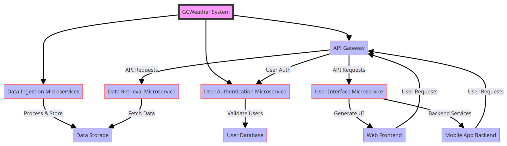

# HTTP & REST API

## HTTP Basics

**HTTP** (HyperText Transfer Protocol) is the foundation of data communication on the web, used to transfer data (such as HTML files and images).

**GET** - Navigate to a URL or click a link in real life.

**POST** - Submit a form on a website, like a username and password.

Popular HTTP Status Codes

- 200 Series (Success): 200 OK, 201 Created.

- 300 Series (Redirection): 301 Moved Permanently, 302 Found.

- 400 Series (Client Error): 400 Bad Request, 401 Unauthorized, 404 Not Found.

- 500 Series (Server Error): 500 Internal Server Error, 503 Service Unavailable.


## Statefulness

**Statefulness & Stickiness**

The server stores information about the client's current session in a stateful system. This is common in traditional web applications. Here's what characterizes a stateful system:

    Session Memory: The server remembers past interactions and may store session data like user authentication, preferences, and other activities.

    Server Dependency: Since the server holds session data, the same server usually handles subsequent requests from the same client. This is important for consistency.

    Resource Intensive: Maintaining state can be resource-intensive, as the server needs to manage and store session data for each client.

    Example: A web application where a user logs in, and the server keeps track of their authentication status and interactions until they log out.


In this diagram:

    Initial Request: The client sends the initial request to the load balancer.

    Load Balancer to Server 1: The load balancer forwards the request to Server 1.

    Response with Session ID: Server 1 responds to the client with a session ID, establishing a sticky session.

    Subsequent Requests: The client sends subsequent requests with the session ID.

    Load Balancer Routes to Server 1: The load balancer forwards these requests to Server 1 based on the session ID, maintaining the sticky session.

    Server 1 Processes Requests: Server 1 continues to handle requests from this client.

    Server 2 Unused: Server 2 remains unused for this particular client due to the stickiness of the session with Server 1.

## Stickiness (Sticky Sessions)

Stickiness or sticky sessions are used in stateful systems, particularly in load-balanced environments. It ensures that requests from a particular client are directed to the same server instance. This is important when:

    Session Data: The server needs to maintain session data (like login status), and it's stored locally on a specific server instance.

    Load Balancers: In a load-balanced environment, without stickiness, a client's requests could be routed to different servers, which might not have the client's session data.

    Trade-off: While it helps maintain session continuity, it can reduce the load balancing efficiency and might lead to uneven server load.

Methods of Implementing Stickiness

    Cookie-Based Stickiness: The most common method, where the load balancer uses a special cookie to track the server assigned to a client.

    IP-Based Stickiness: The load balancer routes requests based on the client’s IP address, sending requests from the same IP to the same server.

    Custom Header or Parameter: Some load balancers can use custom headers or URL parameters to track and maintain session stickiness.


## Statelessness

In a stateless system, each request from the client must contain all the information the server needs to fulfill that request. The server does not store any state of the client's session. This is a crucial principle of RESTful APIs. Characteristics include:

    No Session Memory: The server remembers nothing about the user once the transaction ends. Each request is independent.

    Scalability: Stateless systems are generally more scalable because the server doesn't need to maintain session information. Any server can handle any request.

    Simplicity and Reliability: The stateless nature makes the system simpler and more reliable, as there's less information to manage and synchronize across systems.

    Example: An API where each request contains an authentication token and all necessary data, allowing any server instance to handle any request.


In this diagram:

    Request 1: The client sends a request to the load balancer.

    Load Balancer to Server 1: The load balancer forwards Request 1 to Server 1.

    Response from Server 1: Server 1 processes the request and sends a response back to the client.

    Request 2: The client sends another request to the load balancer.

    Load Balancer to Server 2: This time, the load balancer forwards Request 2 to Server 2.

    Response from Server 2: Server 2 processes the request and responds to the client.

    Statelessness: Each request is independent and does not rely on previous interactions. Different servers can handle other requests without needing a shared session state.

## Monolithic Architecture

    Definition: A monolithic architecture is a software design pattern in which an application is built as a unified unit. All application components (user interface, business logic, and data access layers) are tightly coupled and run as a single service.

    Characteristics: This architecture is simple to develop, test, deploy, and scale vertically. However, it can become complex and unwieldy as the application grows.


Examples

    Older/Traditional Banking Systems.

    Enterprise Resource Planning (SAP ERP) Systems.

    Content Management Systems like WordPress.

    Legacy Government Systems. (Tax filing, public records management, etc.)

### Advantages and Disadvantages

    Advantages: Simplicity in development and deployment, straightforward horizontal scaling, and often more accessible debugging since all components are in one place.

    Disadvantages: Scaling challenges, difficulty implementing changes or updates (especially in large systems), and potential for more extended downtime during maintenance.

## Microservices

This approach structures an application as a collection of loosely coupled services. Microservices often favor stateless architectures for scalability and resilience.

Microservices architecture is a method of developing software applications as a suite of small, independently deployable services. Each service in a microservices architecture is focused on a specific business capability, runs in its process, and communicates with other services through well-defined APIs. This approach stands in contrast to the traditional monolithic architecture, where all components of an application are tightly coupled and run as a single service.

### Critical Characteristics of Microservices:

    Modularity: The application is divided into smaller, manageable pieces (services), each responsible for a specific function or business capability.

    Independence: Each microservice is independently deployable, scalable, and updatable. This allows for faster development cycles and easier maintenance.

    Decentralized Control: Microservices promote decentralized data management and governance. Each service manages its data and logic.

    Technology Diversity: Teams can choose the best technology stack for their microservice, leading to a heterogeneous technology environment.

    Resilience: Failure in one microservice doesn't necessarily bring down the entire application, enhancing the system's overall resilience.

    Scalability: Microservices can be scaled independently, allowing for more efficient resource utilization based on demand for specific application functions.



### Advantages:

    Agility and Speed: Smaller codebases and independent deployment cycles lead to quicker development and faster time-to-market.

    Scalability: It is easier to scale specific application parts that require more resources.

    Resilience: Isolated services reduce the risk of system-wide failures.

    Flexibility in Technology Choices: Microservices can use different programming languages, databases, and software environments.

### Disadvantages:

    Complexity: Managing a system of many different services can be complex, especially regarding network communication, data consistency, and service discovery.

    Overhead: Each microservice might need its own database and transaction management, leading to duplication and increased resource usage.

    Testing Challenges: Testing inter-service interactions can be more complex compared to a monolithic architecture.

    Deployment Challenges: Requires robust DevOps practices, including continuous integration and continuous deployment (CI/CD) pipelines.

## Idempotency

This is a concept where an operation can be applied multiple times without changing the result beyond the initial application. It's an essential concept in stateless architectures, especially for APIs.


## REST API

**RE**presentational **S**tate **T**ransfer is a software architectural style developers apply to web APIs.

REST APIs provide simple, uniform interfaces because they can be used to make data, content, algorithms, media, and other digital resources available through web URLs. Essentially, REST APIs are the most common APIs used across the web today.

Use of a uniform interface (UI)

### HTTP Methods

GET: This method allows the server to find the data you requested and send it back to you.

POST: This method permits the server to create a new entry in the database.

PUT: If you perform the ‘PUT’ request, the server will update an entry in the database.

DELETE: This method allows the server to delete an entry in the database.

### Sample REST API

```
https://api.zippopotam.us/us/08028

http://api.tvmaze.com/search/shows?q=friends


https://jsonplaceholder.typicode.com/posts

https://jsonplaceholder.typicode.com/posts/1

https://jsonplaceholder.typicode.com/posts/1/comments

https://reqres.in/api/users?page=2

https://reqres.in/api/users/2

http://universities.hipolabs.com/search?country=United+States

https://itunes.apple.com/search?term=michael&limit=1000

https://www.boredapi.com/api/activity

https://techcrunch.com/wp-json/wp/v2/posts?per_page=100&context=embed

```

### CURL

Install curl  (Client URL)

curl is a CLI application available for all OS.

https://curl.se/windows/

```brew install curl```

### Usage

```
curl https://api.zippopotam.us/us/08028

curl https://api.zippopotam.us/us/08028 -o zipdata.json
```

### Browser based 

https://httpie.io/app

### VS Code based

https://marketplace.visualstudio.com/items?itemName=rangav.vscode-thunder-client


Summary

    Definition: REST (Representational State Transfer) API is a set of guidelines for building web services. A RESTful API is an API that adheres to these guidelines and allows for interaction with RESTful web services.

    How It Works: REST uses standard HTTP methods like GET, POST, PUT, DELETE, etc. It is stateless, meaning each request from a client to a server must contain all the information needed to understand and complete the request.

    Data Format: REST APIs typically exchange data in JSON or XML format.

    Purpose: REST APIs are designed to be a simple and standardized way for systems to communicate over the web. They enable the backend services to communicate with front-end applications (like SPAs) or other services.

    Use Cases: REST APIs are used in web services, mobile applications, and IoT (Internet of Things) applications for various purposes like fetching data, sending commands, and more.

