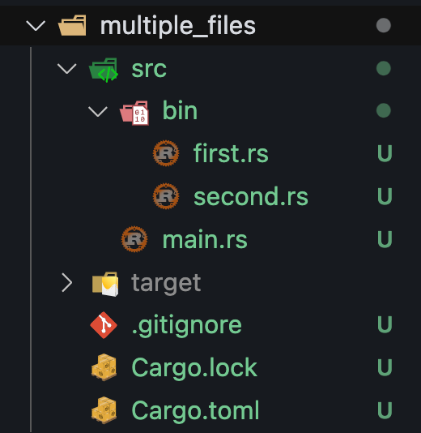

# How to use Multiple .rs files



**first.rs**

```
fn first(){
    println!("{}","From first function");

}
fn main() {
    println!("Hello from first main file!");
    first();
}
```

**second.rs**

```
fn second(){
    println!("{}","From second function");

}

fn main() {
    println!("Hello from second main file!");
    second();
}
```

```
cargo run --bin first

cargo run --bin second
```


