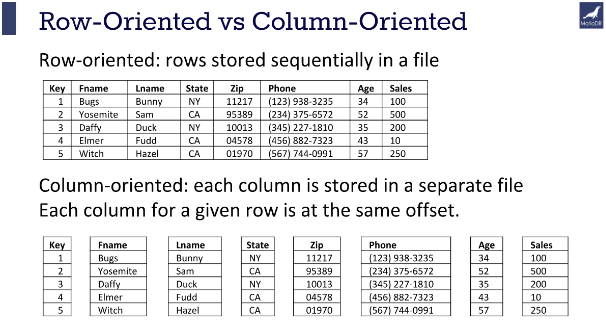

# Storage Format

| Account number | Last name | First name | Purchase (in dollars) |
|----------------|-----------|------------|-----------------------|
| 1001           | Green     | Rachel     | 20.12                 |
| 1002           | Geller    | Ross       | 12.25                 |
| 1003           | Bing      | Chandler   | 45.25                 |

## Row Oriented Storage

In a row-oriented DBMS, the data would be stored as

**1001,Green,Rachel,20.12;**1002,Geller,Ross,12.25;**1003,Bing,Chandler,45.25**

Best suited for OLTP - Transaction data.

## Columnar Oriented Storage

**1001,1002,1003**;Green,Geller,Bing;**Rachel,Ross,Chandler**;20.12,12.25,45.25

Best suited for OLAP - Analytical data.

**Compression**: Since the data in a column tends to be of the same type (e.g., all integers, all strings), and often similar values, it can be compressed much more effectively than row-based data.

**Query Performance**: Queries that only access a subset of columns can read just the data they need, reducing disk I/O and significantly speeding up query execution.

**Analytic Processing**: Columnar storage is well-suited for analytical queries and data warehousing, which often involve complex calculations over large amounts of data. Since these queries often only affect a subset of the columns in a table, columnar storage can lead to significant performance improvements.



Img Src: https://mariadb.com/resources/blog/why-is-columnstore-important/

----

## CSV/TSV/Parquet

- Comma Separated Values
- Tab Separated Values

**Pros

- Tabular Row storage.
- Human-readable is easy to edit manually.
- Simple schema.
- Easy to implement and parse the file(s).

**Cons**

- There is no standard way to present binary data.
- No complex data types.
- Large in size.

## Parquet

Parquet is a columnar storage file format optimized for use with Apache Hadoop and related big data processing frameworks. Twitter and Cloudera developed it to provide a compact and efficient way of storing large, flat datasets.

**Best for WORM (Write Once Read Many)**

The key features of Parquet are:

**Columnar Storage**: Parquet is optimized for columnar storage, unlike row-based files like CSV or TSV. This allows it to compress and encode data efficiently, making it a good fit for storing data frames.

**Schema Evolution**: Parquet supports complex nested data structures, and the schema can be modified over time. This provides much flexibility when dealing with data that may evolve.

**Compression and Encoding**: Parquet allows for highly efficient compression and encoding schemes. This is because columnar storage makes better compression and encoding schemes possible, which can lead to significant storage savings.

**Language Agnostic**: Parquet is built from the ground up for use in many languages. Official libraries are available for reading and writing Parquet files in many languages, including Java, C++, Python, and more.

**Integration**: Parquet is designed to integrate well with various big data frameworks. It has deep support in Apache Hadoop, Apache Spark, and Apache Hive and works well with other data processing frameworks.

In short, Parquet is a powerful tool in the big data ecosystem due to its efficiency, flexibility, and compatibility with a wide range of tools and languages.

### CSV vs Parquet

| Metric            | CSV                   | Parquet                 |
|-------------------|-----------------------|-------------------------|
| File Size         | ~1 GB                 | 100-300 MB              |
| Read Speed        | Slower                | Faster for columnar ops |
| Write Speed       | Faster                | Slower due to compression |
| Schema Support    | None                  | Strong with metadata    |
| Data Types        | Basic                 | Wide range              |
| Query Performance | Slower                | Faster                  |
| Compatibility     | Universal             | Requires specific tools |
| Use Cases         | Simple data exchange  | Large-scale data processing |

These metrics highlight the advantages of using Parquet for efficiency and performance, especially in big data scenarios, while CSV remains useful for simplicity and compatibility.

## Apache Arrow (https://arrow.apache.org/)

**Apache Arrow** defines a language-independent columnar memory format for flat and hierarchical data, organized for efficient analytic operations on modern hardware like CPUs and GPUs. The Arrow memory format also supports zero-copy reads for lightning-fast data access without serialization overhead.

While Parquet is a storage format and Arrow is an in-memory format, they are often used together. Data stored in Parquet files can be read into Arrow’s in-memory format for processing, and vice versa.

Both formats are maintained by the Apache Software Foundation, and they are designed to complement each other. Arrow provides a standard in-memory format, while Parquet provides a standard on-disk format. Together, they enable efficient data processing workflows that involve both storage and in-memory analytics.


## Polars

Polars is a high-performance DataFrame library designed for Rust and Python, aiming to provide fast data manipulation capabilities similar to those found in libraries like Pandas for Python.

- Performance: Polars is built for speed, leveraging Rust’s performance capabilities.
  
- Lazy Execution: Polars supports lazy execution, allowing you to build complex query plans that are only executed when needed. This can optimize performance by minimizing unnecessary computations.
  
- Expressive API: Polars offers an expressive and flexible API for data manipulation, including support for operations like filtering, aggregation, joining, and more.

- Interoperability: While Polars is native to Rust, it also has a Python API, making it accessible to a broader range of developers.

Sure, here's a tabular comparison of Polars and Pandas:

| Feature                  | Polars                                 | Pandas                                 |
|--------------------------|----------------------------------------|----------------------------------------|
| **Language**             | Rust, with Python bindings             | Python                                 |
| **Performance**          | High performance due to parallel execution and memory efficiency | Generally slower for large datasets, single-threaded execution |
| **Memory Usage**         | More memory efficient                  | Higher memory usage                    |
| **Lazy Execution**       | Yes, supports lazy evaluation and query optimization | No, operations are immediately executed |
| **API**                  | Expressive and composable API, consistent behavior | Mature and versatile API, some inconsistencies |
| **Type Safety**          | Strong type safety due to Rust         | Dynamically typed                      |
| **Memory Safety**        | Ensured by Rust's ownership model      | Relies on Python's garbage collector   |
| **Scalability**          | Better for large datasets and complex operations | Can struggle with very large datasets  |
| **Interoperability**     | Supports Rust and Python, integrates with Apache Arrow | Primarily Python, integrates with many Python libraries |
| **GroupBy Operations**   | Fast and efficient, especially on large datasets | Slower, can be memory intensive        |
| **Handling Large Data**  | Can handle larger-than-memory datasets more efficiently | Limited by memory size                 |
| **Multithreading**       | Yes, utilizes multiple CPU cores       | No, single-threaded execution          |
| **Data Representation**  | Uses Apache Arrow format               | Native Pandas data structures          |
| **Robustness**           | Very robust due to Rust's type and memory safety | Robust, but can have runtime errors    |
| **Ease of Use**          | Requires familiarity with Rust concepts for advanced use | Easy to use, especially for those familiar with Python |
| **Community and Ecosystem** | Growing community, less extensive ecosystem compared to Pandas | Large community, extensive ecosystem and support |

### Conclusion
- **Polars** is ideal for high-performance requirements, handling large datasets, and applications where memory efficiency and parallel execution are critical. It benefits from Rust's safety features and offers a powerful, composable API.
- **Pandas** is great for general data manipulation and analysis tasks, with a mature and versatile API, extensive ecosystem, and ease of use, particularly for Python developers.

Choosing between Polars and Pandas depends on your specific needs, including performance requirements, dataset size, and preferred development language.

**Demo**

https://github.com/gchandra10/rust-polars-csv-dataframe-demo


### Convert CSV to Parquet

https://crates.io/crates/csv2parquet

cargo install csv2parquet

csv2parquet sales_100.csv sales_100.parquet


```
use parquet::file::reader::{FileReader, SerializedFileReader};
use std::fs::File;
use std::path::Path;

fn main() {
    let file = File::open(&Path::new("sales_100.parquet")).unwrap();
    let reader = SerializedFileReader::new(file).unwrap();
    let mut iter = reader.get_row_iter(None).unwrap();

    // Retrieve the schema and column names
    let schema = reader.metadata().file_metadata().schema_descr();
    let columns: Vec<String> = schema.columns().iter().map(|c| c.name().to_string()).collect();

     // Print the header
     println!("{}", columns.join(","));

    while let Some(record) = iter.next() {
        println!("{:?}", record);
    }

}
```
